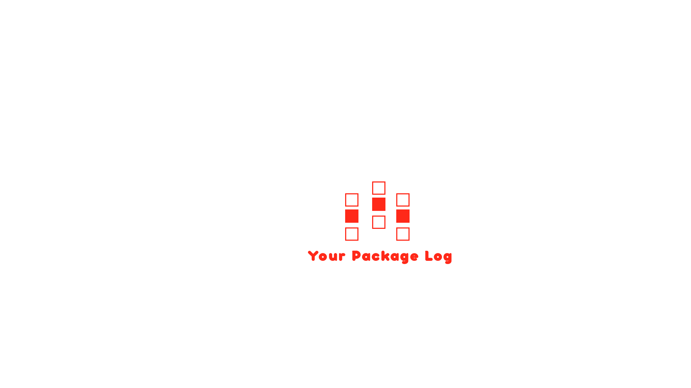

#Add your package badges

[](https://github.com/syrian-open-source/laravel-multi-process/actions/workflows/php.yml)
[](https://github.com/syrian-open-source/laravel-multi-process/actions/workflows/tests.yml)

Design a simple and expressive logo with the same model you see above,
the logo design helps to unify the visual identity and further develop the optimal packages to increase the quality of the software we develop

# Package Name
Your package description,Try to be briefly describing the features of the package,
which versions of Laravel and php it require,
and if there are external resources for learning or explanation

##### 1 - Dependency
The first step is using composer to install the package and automatically update your composer.json file, you can do this by running:

```shell
composer require vendor_name/package_name
```
##### 2 - Copy the package providers to your local config with the publish command, this will publish the config:

Replace this command with your install command,
The package must contain an installation command even if it does not do anything,
this helps with maintenance in the future.

```shell
php artisan package:install
```

Features
-----------
Put the name of the feature and a link to this feature
- [Any feature](https://github.com/syrian-open-source/laravel-package-template/blob/main/docs/feature.md#usage)


Changelog
---------
Please see the [CHANGELOG](https://github.com/syrian-open-source/laravel-package-template/blob/master/CHANGELOG.md) for more information about what has changed or updated or added recently.

Security
--------
If you discover any security related issues, please email them first to "your email", 
if we do not fix it within a short period of time please open a new issue describing your problem. 

Credits
-------
* [your email](https://github.com/syrian-open-source/laravel-package-template/graphs/contributors)
* [All contributors](https://github.com/syrian-open-source/laravel-package-template/graphs/contributors)

#NOTES:
* You should replace all your dependencies into your custom names and files including:
  * vendor namespace.
  * composer information.
  * logo
  * credit and contributors links
  * security email
* To use this template, please click on button above "Use this template".  
* Delete this section after you have finished developing your package
